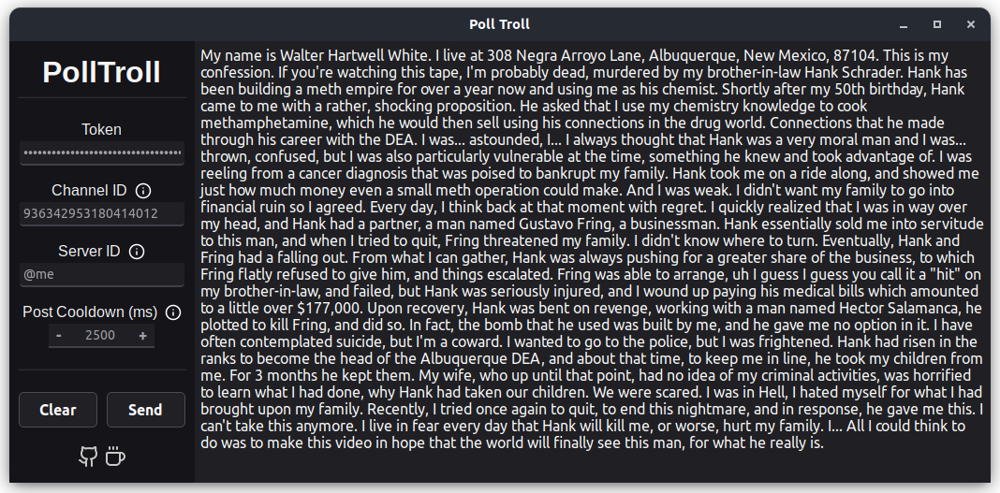

# Poll Troll

> [!WARNING]
> Discord has added a `Create Polls` permission (April 17 2024)  
> If a user does not have this permission they will not be able to post polls, we will show a generic `Unable to create poll` error with an option to retry

Just a tiny desktop app I threw together quickly to play with Discord polls. This is a simple GUI for splitting a large text input into chunks and sending them as polls in Discord.

Very scuffed as it's mostly just intended for testing and Discord will most likely add a sperate permission for polls which will make them not as abusable
| Windows | MacOS | Linux |
| --------------------------------------------------------------------------------------------------------- | ----------------------------------------------------------------------------------------------------------- | --------------------------------------------------------------------------------------------------------------- |
| [x64 exe](https://github.com/nullsoepic/polltroll/releases/download/app-v1.0.0/polltroll_1.0.0_x64-setup.exe) | [x64 dmg](https://github.com/nullsoepic/polltroll/releases/download/app-v1.0.0/polltroll_1.0.0_x64.dmg) | [x64 deb](https://github.com/nullsoepic/polltroll/releases/download/app-v1.0.0/polltroll_1.0.0_amd64.deb) |
| [x64 msi](https://github.com/nullsoepic/polltroll/releases/download/app-v1.0.0/polltroll_1.0.0_x64_en-US.msi) | [AArch64 dmg](https://github.com/nullsoepic/polltroll/releases/download/app-v1.0.0/polltroll_1.0.0_aarch64.dmg) | [x64 AppImage](https://github.com/nullsoepic/polltroll/releases/download/app-v1.0.0/polltroll_1.0.0_amd64.AppImage) |
